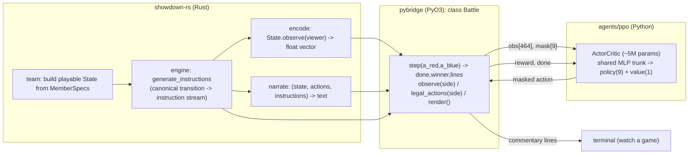
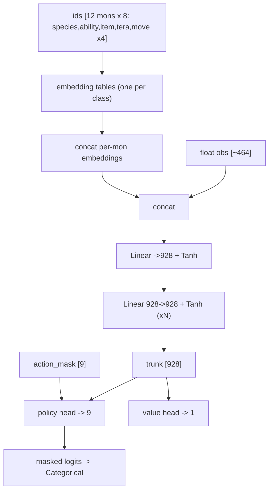
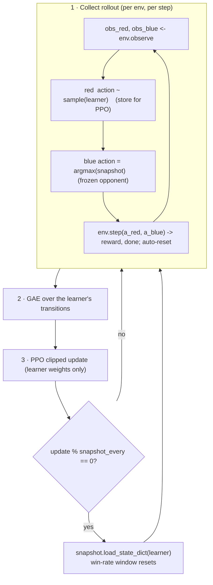

# Agent system design

A small, readable **PPO** agent for the deep-showdown battle engine, now wired to the real Rust
engine via a PyO3 bridge with **greedy self-play** and **live natural-language commentary**.
Keep this in sync with the code in `ppo/` and the bridge in `../showdown-rs/crates/pybridge/`.

Design priorities (in order): **simple & readable**, **small model (~1M params)**,
**machine-agnostic** (CPU / Apple MPS / CUDA), **clean engine boundary** — the agent only ever
sees `(observation, action mask, reward, done)`, computed by render-layers around an unchanged
transition.

---

## 1. Components



The engine produces one canonical artifact per turn — the **instruction stream**. Three readers
project it: `encode` (for the network), `narrate` (for a human), and the bridge's outcome check
(reward/done). None of them live in the transition, so RL throughput is unaffected.

**Action space (9):** `0..3` = move slots, `4..8` = switch to the k-th benched mon. The mask
zeroes illegal actions (no-PP moves, fainted/active switch targets) before sampling.

---

## 2. The model (~5M parameters, with ID embeddings)

The observation has two parts: a **float vector** (hp/status/types/stats/field — `obs_dim≈464`)
and **categorical IDs** per Pokémon (species, ability, item, tera type, 4 moves — `12×8` ints).
Each ID class gets a learned **embedding table** (sized from the bridge's `vocab_sizes()`: species
912, move 955, ability 112, item 25, type 20); the per-mon embeddings are concatenated with the
floats and fed to a shared MLP → masked policy head (9) + value head. This is "Level 1":
embeddings + concat into a flat MLP (not yet a per-entity / attention encoder — that's Level 2).



With `hidden_dim=928`, `n_hidden_layers=2`, `embed_dim=32` it is **~5.08M** params. The IDs come
from `observe(viewer)`, so a hidden foe item/ability/move arrives as its `Unknown`/`None` sentinel
index — fog-of-war preserved. `embed=None` gives the old pure-float MLP (the placeholder trainer).

---

## 3. Frozen-snapshot self-play

The **learner** samples actions and trains via PPO. The **opponent** plays greedily (argmax) from
a **frozen snapshot** of the learner — a *separate* network whose weights are copied from the
learner every `--snapshot-every` updates and otherwise held fixed (no gradients).
`--snapshot-every 0` falls back to a *live* moving-target opponent. Reward is sparse: +1 / -1 to
the learner on win / loss.

**Both sides are trained.** Observations/actions are egocentric (`encode(state, viewer)` puts "me"
first), so one policy plays either side — but only if it *sees* both. The learner is therefore
assigned a **random side each episode** (the snapshot takes the other), so it trains on both
`red_team`-as-me and `blue_team`-as-me states. Without this the network only ever learns one
side, the opponent plays its untrained side out-of-distribution, and `win_rate` inflates toward 1
against an effectively-handicapped opponent. With it, win-rate sits near ~0.5 — the honest signal
of marginal improvement over a near-equal recent self (a slightly-below-0.5 reading is mostly the
sampling-learner vs greedy-opponent handicap, not regression).



The PPO objective (clipped surrogate + value loss + entropy bonus, GAE, minibatch epochs) is
shared with the placeholder trainer — only data collection + the frozen opponent differ. Every
`--render-every` updates one full game is played to the terminal with live commentary.

---

## 4. Inference / watching a battle

`Battle.step(a_red, a_blue, narrate=True)` returns the turn's commentary; `Battle.render()`
prints an HP board. `python -m ppo.selfplay --watch` plays one game with the current policy.

```mermaid
sequenceDiagram
    participant Loop as selfplay
    participant Br as Battle (bridge)
    participant Eng as engine
    Loop->>Br: observe(side), legal_actions(side)
    Br->>Eng: encode(State.observe(side))
    Loop->>Loop: action = policy(obs, mask)
    Loop->>Br: step(a_red, a_blue, narrate=True)
    Br->>Eng: generate_instructions -> sample branch -> apply
    Br->>Eng: narrate(pre, actions, instructions)
    Br-->>Loop: done, winner, commentary lines
    Loop->>Loop: print lines (follow live)
```

---

## 5. Status & what's next

**Done:** PyO3 bridge (`showdown_engine.Battle`), observation encoder, narration layer, team
builder, engine-backed vector env, frozen-snapshot self-play trainer (with a live-opponent
fallback), live terminal commentary.

**Not yet (intentionally):** league / population play (a *pool* of past snapshots à la AlphaStar,
vs. the single snapshot here); richer reward shaping; determinization over hidden info; randomized
teams (one fixed matchup for now); special-case action types (forced two-turn locks, etc.); a
proper display-name table (commentary uses prettified PS ids). Each slots in behind the same
`Battle` interface.
