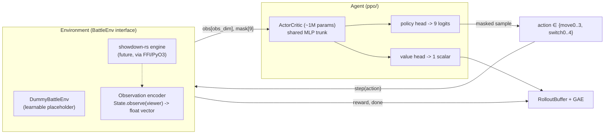
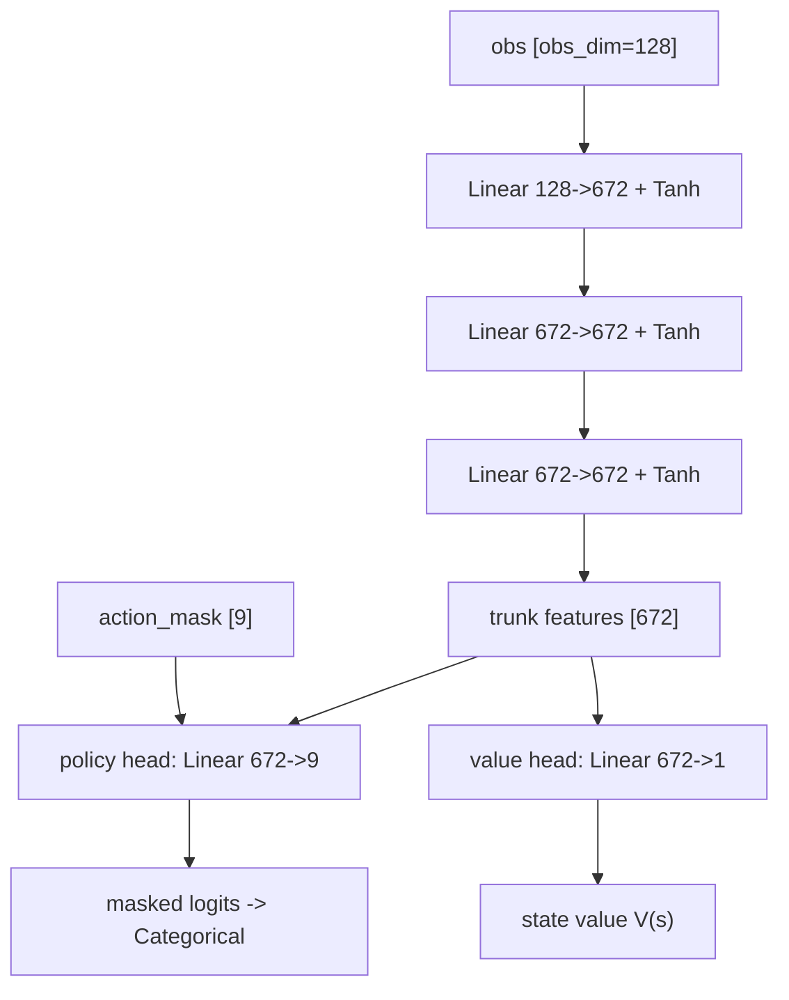
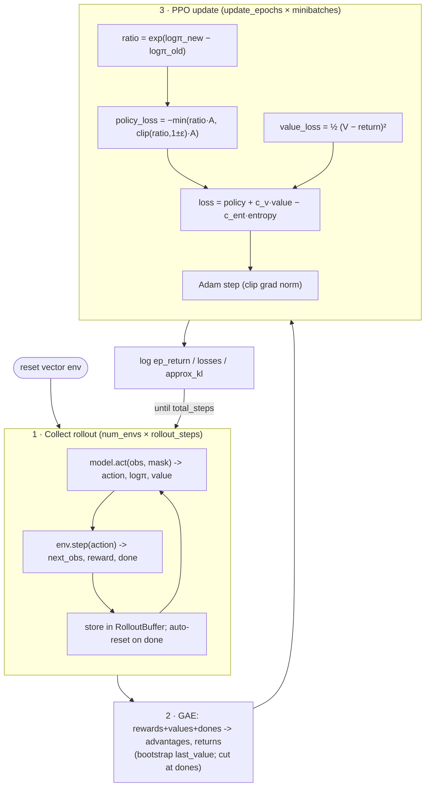
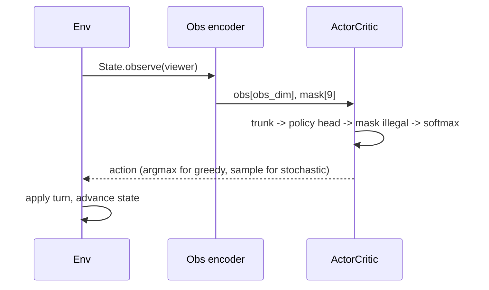

# Agent system design

A small, readable **PPO** agent for the deep-showdown battle engine. This document is the
living architecture reference — keep it in sync with the code in `ppo/`.

Design priorities (in order): **simple & readable**, **small model (~1M params)**,
**machine-agnostic** (CPU / Apple MPS / CUDA), **clean boundary to the Rust engine** so the
placeholder environment can be swapped for the real simulator without touching the algorithm.

---

## 1. Components

The agent only ever talks to the environment through four values — observation vector,
action mask, reward, done — so PPO is completely decoupled from where the battle comes from.

**Action space (9):** `0..3` = the four move slots, `4..8` = switch to one of the five
benched team members. The **action mask** zeroes illegal actions (no-PP / disabled moves,
fainted or already-active switch targets) before sampling. Special cases (forced switches,
two-turn locks, etc.) are out of scope for now — the placeholder marks all actions legal.

---

## 2. The model (~1M parameters)

A shared trunk with two linear heads. Small on purpose; sized to ~1M at `obs_dim=128`,
`hidden_dim=672`, `n_hidden_layers=2`. Orthogonal init with a tiny gain on the policy head so
the initial policy is near-uniform.

Total trainable params ≈ **1.0M** (printed at startup via `ActorCritic.num_params()`).
The bulk sits in the two 672×672 hidden layers, so the count is stable as `obs_dim` changes.

---

## 3. Training loop (PPO)

On-policy: collect a batch of fresh transitions with the current policy, estimate advantages
with GAE, then take a few epochs of clipped-objective minibatch updates. Repeat.

Key hyperparameters (`config.py`): `gamma=0.99`, `gae_lambda=0.95`, `clip_eps=0.2`,
`entropy_coef=0.01`, `value_coef=0.5`, `lr=3e-4`, `update_epochs=4`, `minibatch_size=256`,
`num_envs=8`, `rollout_steps=128` (batch = 1024).

---

## 4. Inference (acting in a battle)

At inference the value head is unused; only the masked policy matters. Greedy = `argmax`,
exploratory = sample from the masked `Categorical`.

---

## 5. Boundary to the Rust engine (the one thing to build next)

The agent is already written against the final contract. Wiring the real engine means
implementing one `BattleEnv` whose:

- **`obs`** is a fixed-length float encoding of `State.observe(viewer)` (the hidden-info view
  from `showdown-rs`) — set `PPOConfig.obs_dim` to its length.
- **`step(action)`** maps `0..8` to a `MoveChoice`, advances the engine one turn (sampling a
  concrete outcome branch, and an opponent action — self-play or a fixed bot), and returns the
  next observation, the next legal-action mask, the reward (e.g. ±1 on win/loss), and done.

Because the engine state is `Copy`/cheap, the env can run many instances in `SyncVectorEnv`
(or a future native vectorized bridge) without changing anything above this line.

**Not yet covered (intentionally):** opponent modeling / self-play scheduling, determinization
over hidden info (sampling concrete states from `observe`), reward shaping, and the special-case
action types. Each slots in behind the same interface.
